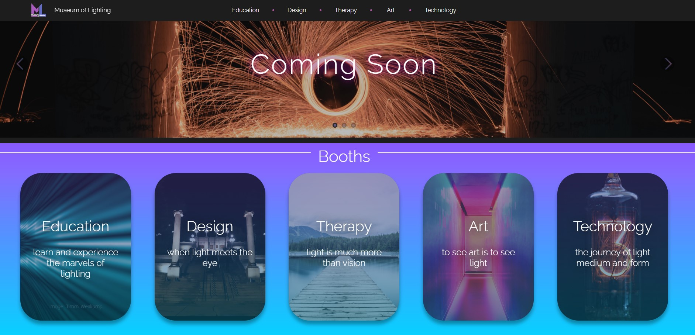

# Example-WebSite
An example website created with React and nodeJS (MERN stack) for a personal AR/VR lighting project. 
Additonaly uses the styled components library for React on top of regular css.

## Link

The website can be seen at https://www.museumoflighting.com/

  
